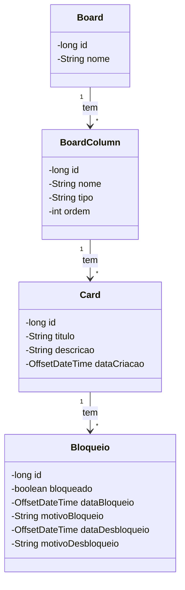

# SimplesBordTarefas

## Diagrama de Classe

```mermaid

classDiagram
    class Board {
        -long id
        -String nome
    }

    class BoardColumn {
        -long id
        -String nome
        -String tipo
        -int ordem
    }

    class Card {
        -long id
        -String titulo
        -String descricao
        -OffsetDateTime dataCriacao
    }

    class Bloqueio {
        -long id
        -boolean bloqueado
        -OffsetDateTime dataBloqueio
        -String motivoBloqueio
        -OffsetDateTime dataDesbloqueio
        -String motivoDesbloqueio
    }

    Board "1" --> "*" BoardColumn : tem
    BoardColumn "1" --> "*" Card : tem
    Card "1" --> "*" Bloqueio : tem


```

