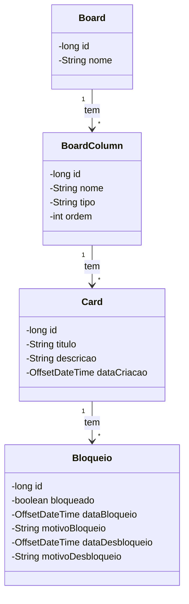

# SimplesBordTarefas

Projeto desenvolvido para o Desafio de Projeto do módulo de Banco de Dados do BotCamp Decola TEC 2025. O objetivo era criar um Board de tarefas simplificado, onde é possível:

- Criar um board
- Criar colunas
- Criar cards
- Bloquear cards
- Desbloquear cards
- Cancelar cards
- Mover um card para a próxima coluna, seguindo a ordem das colunas. Por padrão, o board tem 3 colunas: "Início", "Fim" e a coluna de "Cancelamento". Qualquer coluna adicional é adicionada entre a coluna de "Início" e a coluna de "Fim", em uma ordem fixa. Um card só pode se mover em uma direção, a menos que seja cancelado, pois cards cancelados ficam restritos à coluna de cancelados.
- Configurar o acesso ao banco de dados por meio da classe `java.sql.Connection`.
- Versionar a criação do banco de dados, fazendo uso do Liquibase ou ferramentas similares.

**Informação adicional:** Neste projeto, os atributos nome, URL, usuário e senha do banco de dados são passados como variáveis de ambiente.

## Diagrama de Classe

## Tecnologias Empregadas
- Mysql
- Liquibase

